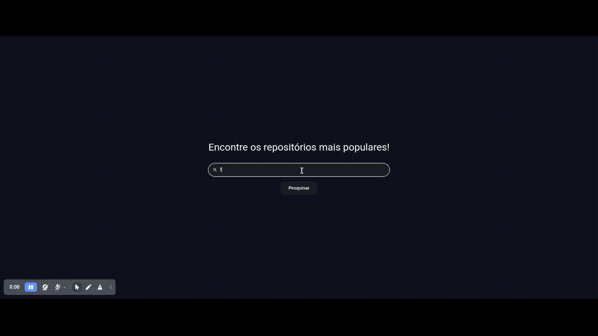

# Bycoders_

## Como instalar

1. Após baixar/clonar o projeto, abra o terminal na raiz do projeto, digite o comando abaixo e tecle enter:

```bash
yarn
```

> **Observação**: Se você não possui yarn instalado, será necessário instala-lo antes. Consulte https://classic.yarnpkg.com/lang/en/docs/install

2. Após isso, digite o comando abaixo e tecle enter:

```bash
yarn run dev
```

3. Agora abra o seu navegador e acesse http://localhost:3000/

> **Observação**: O GitHub possui um limite de 60 consultas/hora vindas de um mesmo IP. Para aumentar este limite, é necessário um **Personal Access Token (Classic)**. Você pode gerar um nas configurações da sua conta. Consulte https://docs.github.com/pt/enterprise-server@3.6/authentication/keeping-your-account-and-data-secure/managing-your-personal-access-tokens

## Configurando um Personal Access Token (Classic)

1. Abra o arquivo `.env` que está na raiz do projeto e descomente a linha `VITE_API_TOKEN=token`, inserindo na frente o seu **Personal Access Token (Classic)**. (NÃO remover a palavra `token `!):

```env
VITE_API_TOKEN=token seuTokenAqui
```

## Demo

